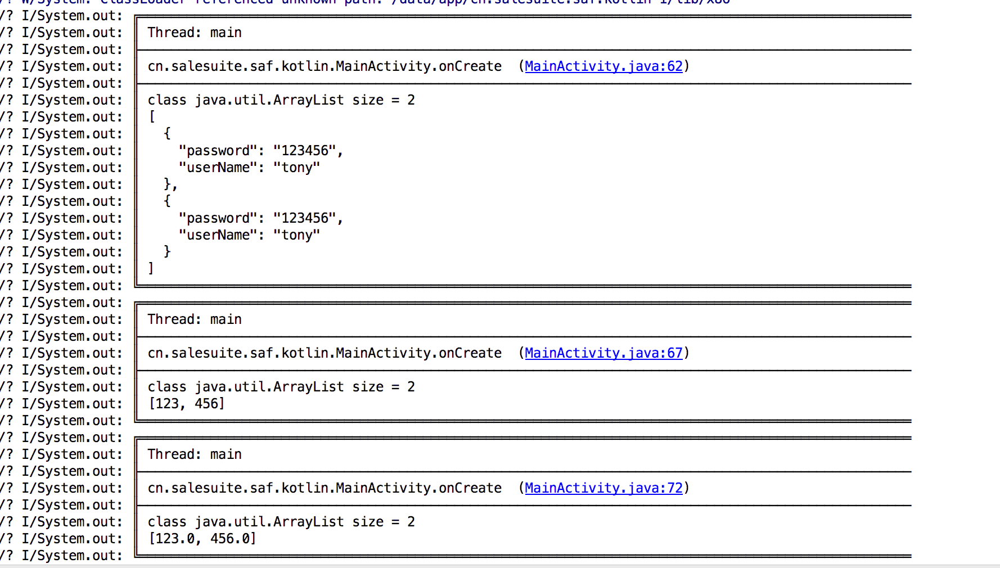
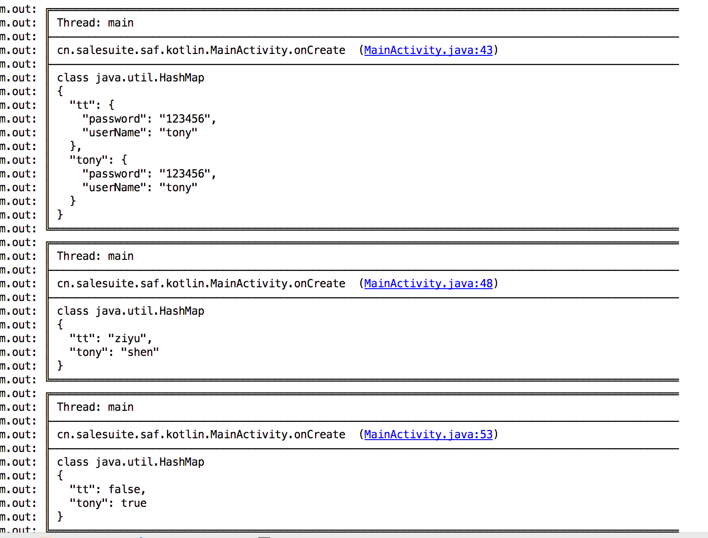
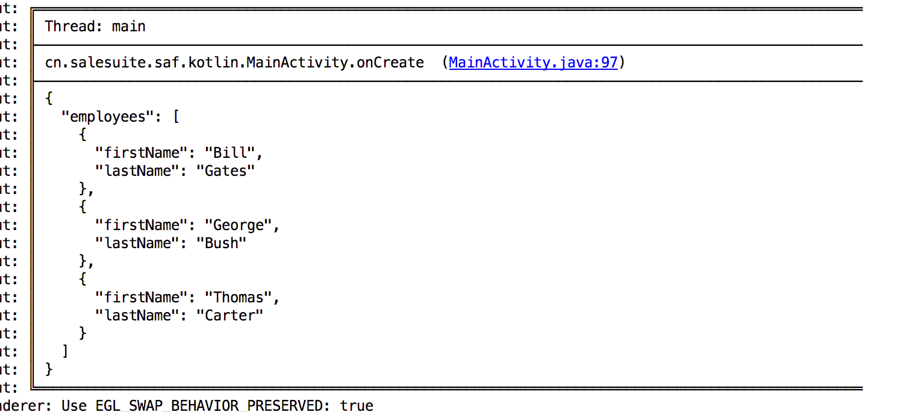
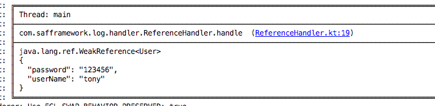
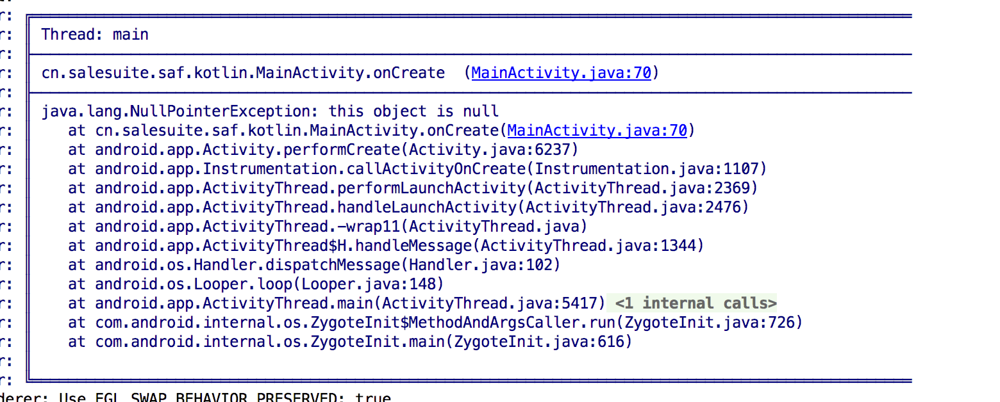
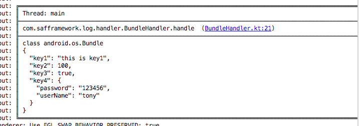
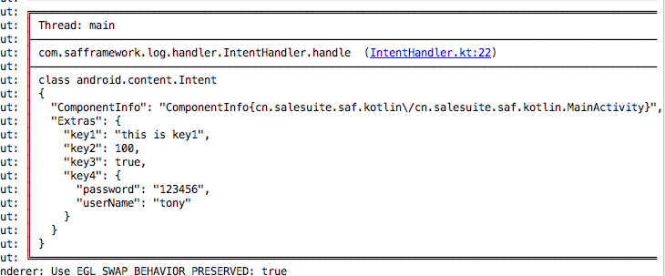

# SAF-Kotlin-log

[](http://www.weibo.com/fengzhizi715)
[  ](https://bintray.com/fengzhizi715/maven/saf-log-core/_latestVersion)
[](https://www.apache.org/licenses/LICENSE-2.0.html)


它不仅能够打印出漂亮的日志格式，还支持高度定制日志格式。

它可以在任何使用 Java、Kotlin 开发的 Android 项目中使用。即使在您的项目中只使用 Java，也无需额外添加 Kotlin 的配置。


# 下载安装

Gradle:

```groovy
implementation 'com.safframework.log:saf-log-core:2.1.3'
```

```groovy
implementation 'com.safframework.log:saf-log-file:2.1.3'
```

```groovy
implementation 'com.safframework.log:saf-log-okhttp:2.1.3'
```

# 功能：

* 日志框架高度可扩展
* 支持自定义 tag，便于过滤
* 支持多种日志级别
* 支持显示/关闭当前线程信息
* 支持自定义 Header，可以用于标识手机、App 等版本信息
* 基于责任链模式来打造对象的打印，将对象打印成json风格，方便阅读。默认支持JSON字符串、集合、Map、Bundle、Intent、Reference、Throwable、Uri等类型的打印，分别做了特别的格式化处理。
* 使用 json() 方法打印字符串时，支持超长日志的打印，解决了 Logcat 4K 字符截断的问题。
* 支持自定义对象的解析处理，将其打印成自己想要的风格。
* 支持保存日志到文件，底层基于 Kotlin Coroutines
* 支持自定义日志格式存储到文件
* 提供基于 OkHttp 的日志拦截器，能够打印 request、response 信息，便于网络接口的调试。

# 使用方法：

## 1.tag使用

如果不考虑显示日志的tag，可以直接使用，L 会提供默认的tag。

```java
String s = "abcd";
L.i(s);
```

如果需要使用 tag，可以在 Activity 的 onCreate() 中添加如下的代码，类名则对应是tag的名称

```java
L.init(this.getClass());

```

当然，init() 除了支持传递 Class 对象，还支持传 String 对象。

## 2.日志级别

支持以下几种日志级别，除此之外还能将任何对象打印成json格式

| 方法名        | 作用          |
| ------------- |:-------------:|
| e()       |Error级别打印日志|
| w()        |Warn级别打印日志|
| i()        |Info级别打印日志|
| d()        |Debug级别打印日志|
|json()      |将日志以json格式打印出来|

还可以设置全局的日志级别，最好在Application中进行全局的配置。

java中的使用方法：

```java
L.setLogLevel(LogLevel.INFO);
```

kotlin中的使用方法：

```kotlin
L.logLevel= LogLevel.INFO
```
## 3.打印日志

以e、w、i、d打印的日志风格如下：<br>
第一行显示线程名<br>
第二行显示类中打印的行数<br>
第三行显示打印的具体内容


```Java
╔════════════════════════════════════════════════════════════════════════════════════════
║ Thread: main
╟────────────────────────────────────────────────────────────────────────────────────────
║ cn.salesuite.saf.aspects.TraceAspect.traceMethod  (TraceAspect.java:35)
╟────────────────────────────────────────────────────────────────────────────────────────
║ loadUser() take [14ms]
╚════════════════════════════════════════════════════════════════════════════════════════
```

json方法的使用

```java
Object obj = ...
L.json(obj);
```

## 4.支持各种对象类型的打印
多种对象类型都可以使用json()方法打印成json风格。
### 4.1 将List、Set格式化打印
```java
        User u = new User();
        u.userName = "tony";
        u.password = "123456";

        List<User> list = new ArrayList<>();
        list.add(u);
        list.add(u);
        L.json(list);

        List<String> ids = new ArrayList<>();
        ids.add("123");
        ids.add("456");
        L.json(ids);

        List<Double> idd = new ArrayList<>();
        idd.add(123D);
        idd.add(456D);
        L.json(idd);
```
打印效果：



### 4.2 将Map格式化打印
```java
        User u = new User();
        u.userName = "tony";
        u.password = "123456";
        
        Map<String,User> map = new HashMap<>();
        map.put("tony",u);
        map.put("tt",u);
        L.json(map);

        Map<String,String> map2 = new HashMap<>();
        map2.put("tony","shen");
        map2.put("tt","ziyu");
        L.json(map2);

        Map<String,Boolean> map3 = new HashMap<>();
        map3.put("tony",true);
        map3.put("tt",false);
        L.json(map3);
```
打印效果：



### 4.3 将JSON字符串格式化打印
```java
        String jsonString = "{\n" +
                "    \"employees\": [\n" +
                "        {\n" +
                "            \"firstName\": \"Bill\",\n" +
                "            \"lastName\": \"Gates\"\n" +
                "        },\n" +
                "        {\n" +
                "            \"firstName\": \"George\",\n" +
                "            \"lastName\": \"Bush\"\n" +
                "        },\n" +
                "        {\n" +
                "            \"firstName\": \"Thomas\",\n" +
                "            \"lastName\": \"Carter\"\n" +
                "        }\n" +
                "    ]\n" +
                "}";

        L.json(jsonString);
``` 
打印效果：



### 4.4 将Reference格式化打印
```java
        User u = new User();
        u.userName = "tony";
        u.password = "123456";
        
        L.json(new WeakReference<User>(u));
```
打印效果：



### 4.5 将Throwable格式化打印
```java
L.json(new NullPointerException("this object is null"));
```
打印效果：



### 4.6 将Bundle格式化打印
```java
        User u = new User();
        u.userName = "tony";
        u.password = "123456";
        
        Bundle bundle = new Bundle();
        bundle.putString("key1","this is key1");
        bundle.putInt("key2",100);
        bundle.putBoolean("key3",true);
        bundle.putSerializable("key4",u);
        L.json(bundle);
```
打印效果：



### 4.7 将Intent格式化打印
```java
        User u = new User();
        u.userName = "tony";
        u.password = "123456";
        
        Bundle bundle = new Bundle();
        bundle.putString("key1","this is key1");
        bundle.putInt("key2",100);
        bundle.putBoolean("key3",true);
        bundle.putSerializable("key4",u);

        Intent i = new Intent(this,MainActivity.class);
        i.putExtras(bundle);
        L.json(i);
```
打印效果：



### 4.8 将Uri格式化打印
```java
        Uri uri = Uri.parse("http://www.java2s.com:8080/yourpath/fileName.htm?stove=10&path=32&id=4#harvic");
        L.json(uri);
```
打印效果：


## 5.自定义Header

我们公司之前的产品是做deep link以及移动端广告相关的sdk。从开发这些产品中，我们获得的经验是日志里要是能够记录手机的一些信息，方便根据机型和操作系统版本来调试bug就好了。

由此产生了L的Header。通常情况下，把手机的一些信息放入Header中，方便调试时一眼识别手机出的机型、操作系统版本号、App版本号等等。一旦定义好Header，所有使用L的日志上都会显示Header的内容。

## 6.针对Kotlin项目的优化
借助Kotlin的扩展函数的特性，任何对象都可以使用`json()`方法来打印其自身。

也支持形如：

```kotlin
L.i {
   "hi $message"
}
```

```kotlin
L.i("customerTag") {
   "hi $message"
}
```


## TODO List：

* 迁移到 androidX


联系方式
===

Wechat：fengzhizi715


> Java与Android技术栈：每周更新推送原创技术文章，欢迎扫描下方的公众号二维码并关注，期待与您的共同成长和进步。


ChangeLog
===
[版本更新记录](CHANGELOG.md)

License
-------

    Copyright (C) 2017 - present, Tony Shen.

    Licensed under the Apache License, Version 2.0 (the "License");
    you may not use this file except in compliance with the License.
    You may obtain a copy of the License at

       http://www.apache.org/licenses/LICENSE-2.0

    Unless required by applicable law or agreed to in writing, software
    distributed under the License is distributed on an "AS IS" BASIS,
    WITHOUT WARRANTIES OR CONDITIONS OF ANY KIND, either express or implied.
    See the License for the specific language governing permissions and
    limitations under the License.
